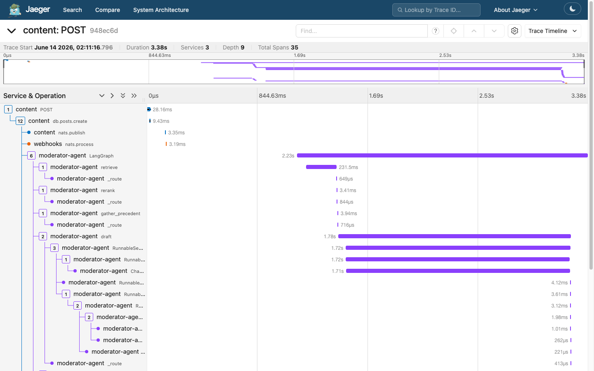
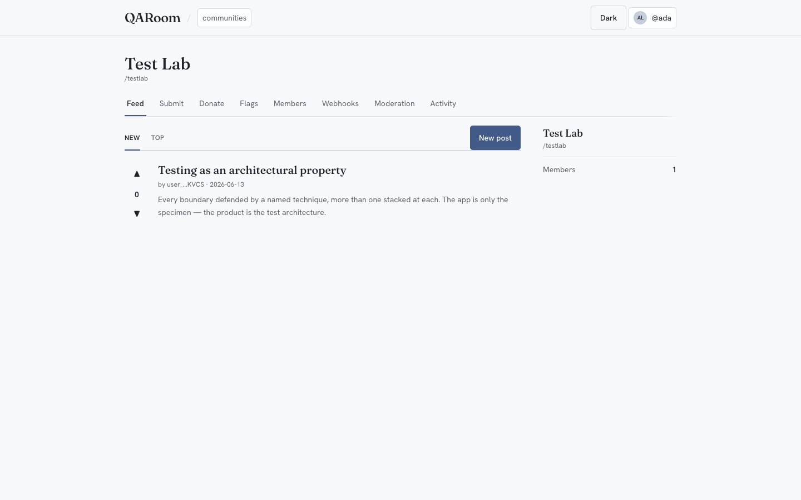
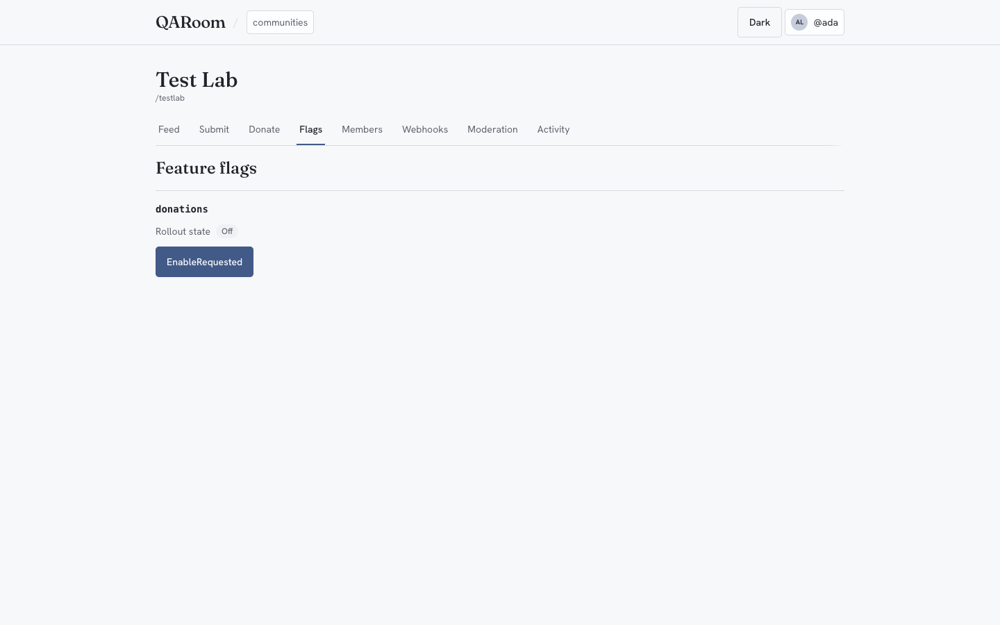
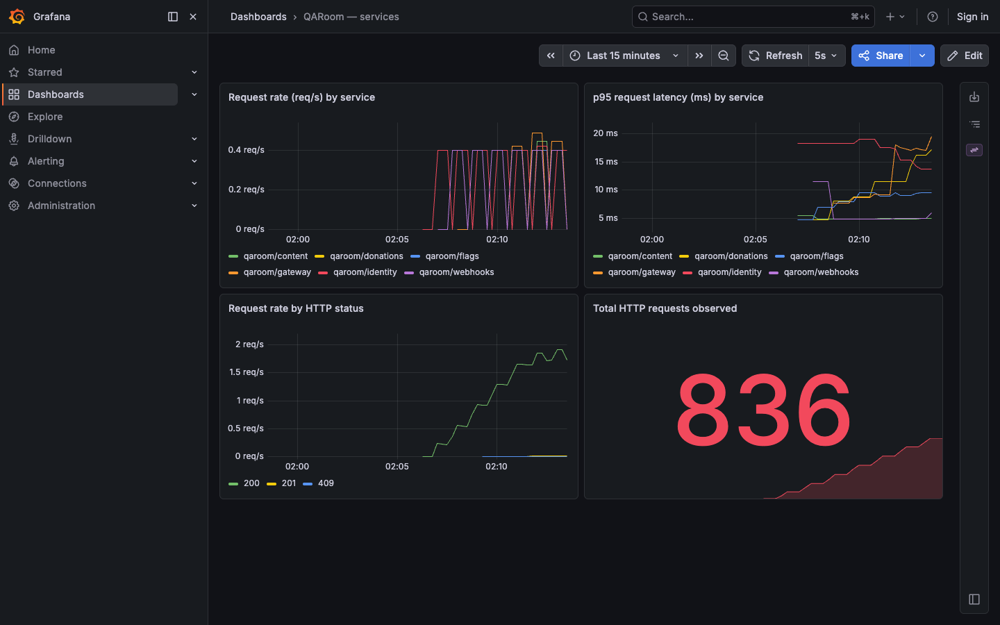
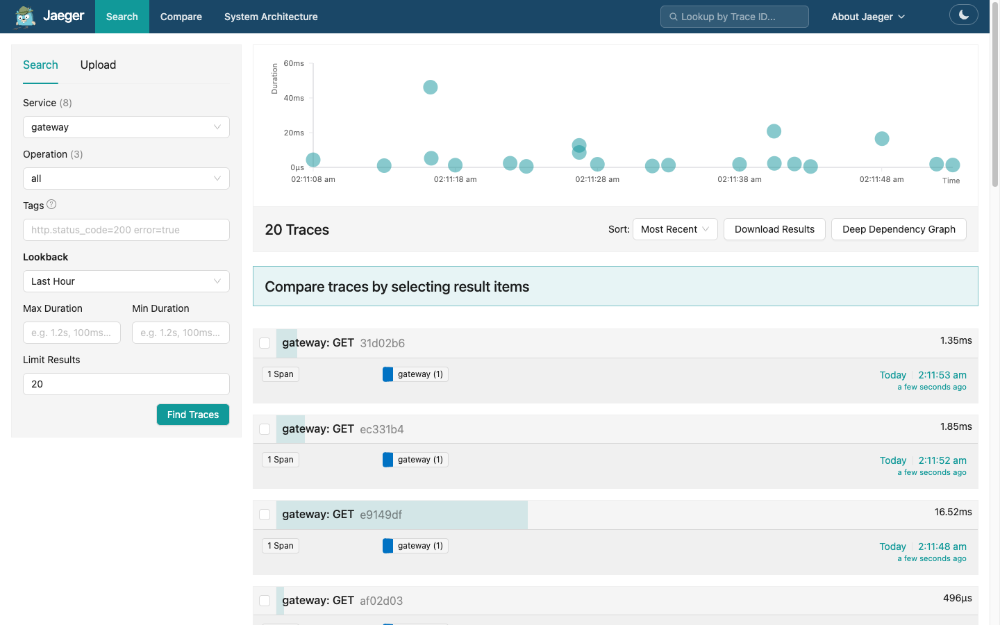

# QARoom Architecture

> **The two minute version (plain English).** QARoom is a small, realistic app built to demonstrate
> good testing on a modern stack (TypeScript services, a React frontend, a Python AI service, async
> messaging, Kubernetes). The big idea: **a green test suite only matters if you can show the failure
> it would catch.** So every guarantee here ships with the bug that breaks it and one command to watch a
> real test go red (`pnpm prove <id> --break`). The system is *designed* to be testable, with
> controllable time, inspectable state, and hand drawn diagrams of what is legal. That is what makes the
> harder tests possible at all: the AI feature, events between services, failure injection. The rest of
> this page is the detailed version. The [README](README.md) is the fast one.

> **Thesis (the dual claim):**
> — **Organizationally,** quality is an *architectural property the system makes cheap to sustain*
> across people, agents, and time — not a property of any one test run.
> — **Technically,** the architecture is a **checking + evidence layer in service of a testing mission**
> ([ADR-0030](docs/adr/0030-checking-architecture-in-service-of-a-testing-mission.md)): its checks are
> made *severe* and *tamper-evident*, so **green means something even when agents write the code.**
>
> The machine *checks* (algorithmic verification of a pre-stated proposition); the *testing*, which means
> choosing the invariants and threat model and judging that a counterexample matters, is the human act the
> checks serve. The division of labor: agents do the spec-derived mechanical mass; humans spend scarce
> judgment on the emergent risk surface; the gates verify the agent's output is real. Every claim ships
> with the toggle that turns its gate red (`pnpm prove <id> --break`).
>
> This is the one-page mental model. Read it first, then descend: the **diagrams** in the
> [Structurizr model site](https://mariusargatu.github.io/QARoom/architecture/), the **decisions** in
> [`docs/adr/`](docs/adr/) (and how each technique was first vetted, the Milestone-0
> [**spikes**](docs/spikes/)), the **operating model** (cost, frictions, restraint) in
> [`docs/operating-model.md`](docs/operating-model.md), the **enforced contracts** in the code
> ([where the truth lives](#8-where-the-truth-lives)).

QARoom is a multi-tenant social platform (communities, posts, votes, donations behind a flag) built as
a *specimen*: a demonstration that defense-in-depth-and-breadth *checking* can be an emergent property
of how a distributed system is built. Every architectural choice points back to a testing technique it
enables, and every technique sits at the boundary it defends (§3): the same decision from opposite ends
([ADR-0001](docs/adr/0001-foundational-decisions.md)). The mission is **falsification, not confirmation**:
a green suite *corroborates*, it never *proves*; the unit of quality is **severity** (`P(red | behavior
broken)`), measured by mutation testing and `prove --break`, not coverage. Two rules hold throughout:
**complexity must earn its place** (sized exactly for v1) and **numbers are derived, never typed by hand**.

---

## 1. The system, at altitude

<!-- stats:start (generated by `pnpm stats:render --readme`; do not edit) -->
9 services · 7 packages + 1 helm chart · 40 ADRs · 13 boundaries · 23 falsifiable claims

<sub>These counts are read from the source (the manifest + the folders on disk), not typed by hand. `pnpm stats:render` writes this line and `pnpm claims:verify` fails the build if it drifts. Live test totals come from a CI run's `test-results/summary.json` artifact (gitignored here); `pnpm prove` reads them locally.</sub>
<!-- stats:end -->

**The shape, in one breath:** the React/Vite `web` SPA reaches one origin (`*.localhost` via Traefik); the Fastify `gateway` edge proxies every upstream over HTTP (and fronts identity + moderation reads, [ADR-0022](docs/adr/0022-gateway-fronts-identity-and-moderation-for-the-web-edge.md)); `content`, `flags`, `donations`, and `identity` each own a Postgres; state-change events flow over **NATS JetStream** (`qaroom.<service>.<entity>.<community_id>.<event>`, `community_id` fixed at position 3) to the Python `moderator-agent` (RAG, [ADR-0018](docs/adr/0018-moderator-agent-architecture.md)/[0020](docs/adr/0020-moderator-rag-and-eval-stack.md)) and the `webhooks` delivery edge ([ADR-0019](docs/adr/0019-webhooks-as-a-tested-delivery-edge.md)). Cross-cutting: OpenTelemetry (`tenant.id` on every span) → Collector → Jaeger + Prometheus/Grafana; Tracetest; Microcks; Chaos Mesh + Litmus. Everything runs on Kubernetes — k3d local via Tilt, KinD in CI.

**The living picture** — context, containers, components, the create-post trace, the deployment topology — is the [Structurizr model site](https://mariusargatu.github.io/QARoom/architecture/), generated from [`docs/structurizr/`](docs/structurizr/) and grounded in `services/*`. The five event channels (logical names; the literal subject tokens are `posts`/`votes`/`flag`/`donation`/`decision` + `created`/`cast`/`changed`/`changed`/`recorded`):

| Event | Publisher | Consumers |
|---|---|---|
| `post.created` | content | moderator-agent (wildcard → review); webhooks |
| `vote.cast` | content | webhooks |
| `flag.state.changed` | flags | donations (→ `flag_cache`); gateway (→ WS feed); webhooks |
| `donation.state.changed` | donations | gateway (→ WS feed); webhooks |
| `moderation.decision.recorded` | moderator-agent | webhooks |

Each service owns one Postgres (moderator adds pgvector); every DB also carries the messaging substrate it needs (`outbox` / `processed_events` / `idempotency_responses`).

**Synchronous REST** carries queries and external-facing calls; **NATS JetStream** carries all
cross-service *state-change events*. The split is "along observation, not preference: the writer
must not block on, or know about, who reacts to a state change … whereas a query has a single
caller that needs the result now" ([ADR-0010](docs/adr/0010-sync-vs-async-and-otel-propagation-contract.md)).
A mutation typically does both.

**Per-service Postgres** is what makes the process and contract boundaries *real* (and what the
transactional outbox needs). **Communities are tenants** — a shared schema with a `community_id`
discriminator ([ADR-0007](docs/adr/0007-communities-as-tenants-shared-schema-discriminator.md));
cross-community leakage must be impossible by service-layer enforcement and is verified by
property-based isolation tests.

The service roster, and the *one* boundary each exists to teach (full table:
[`scripts/lib/manifests/boundary-registry.ts`](scripts/lib/manifests/boundary-registry.ts),
rendered into the boundary map in §3):

| Service | Role | Boundary it teaches |
|---|---|---|
| **gateway** | Fastify edge: routing, response composition, RFC 7807 errors; proxies identity + moderation reads (ADR-0022). Verifies JWTs at the edge **only** for the events-polling membership read (ADR-0025); the proxy plane is otherwise unauthenticated by design (§7). | Trust (Schemathesis) + Process (Pact) |
| **identity** | Users, sessions, membership/roles, JWT issuance + JWKS. | Identity issuance (JWKS contract, rotation-as-state-machine, JWT property tests) |
| **content** | Posts, comments, votes, score, feed. Publishes `post.created` etc. | Tenancy + voting invariants (fast-check, load) |
| **flags** | Flag definitions, per-community resolution, donations-rollout XState machine. | State (MBT + chaos of cache invalidation) |
| **donations** | Donation transactions over REST to the Microcks-mocked payment provider. | Untrusted external payment (schema validation + chaos) |
| **web** | React/Vite atomic-design UI, rollout dashboard, WS live updates with polling parity. | UI sequence + visual (Storybook + Playwright CT + model-based E2E) |
| **moderator-agent** | The one Python service (uv/FastAPI/LangGraph). Retrieval-grounded RAG agent; **proposes, does not enforce.** | LLM external dependency (DeepEval/DeepTeam/PyRIT + metamorphic + reverse-conformance) |
| **webhooks** | Outbound delivery edge: consumes all five channels, durable ledger, at-least-once + HMAC + SSRF guard. | Delivery edge (retry contract + delivery XState) |
| **qaroom-mcp** | Cross-service read-first MCP tool surface, a first-class tested service. | Agent tool surface (four typed gates) |

---

## 2. The reasoning spine: what makes the system testable

Four properties are deliberately engineered *into the system* so that whole classes of tests
become possible. These are preconditions, not afterthoughts.

- **Determinism, injected everywhere** ([ADR-0001](docs/adr/0001-foundational-decisions.md) Commitment 6).
  Time is `clock.now()`, IDs are `idGenerator.next()`, randomness is `randomness.next()` — real in
  prod, seeded in tests. A direct `new Date()`/`Math.random()`/`crypto.randomUUID()` in non-test
  code is a **P0 defect, lint-enforced**. *Why:* property tests ship a failing counter-example
  *and its seed*; scenario replay and chaos reproduce wall-clock-dependent bugs without sleeps or
  flake. Two time layers: business logic reads only the injected Clock; OS wall-clock is reserved
  for chaos perturbation.

- **Observable state, as a contract** (Commitment 7). Every service exposes
  `GET /system/state` (with an `as_of {snapshot_id, lamport, wall_clock}` envelope read at
  `REPEATABLE READ`, all writes funneled through one `LamportGate`),
  `GET /system/capabilities` (MCP-tool-shaped JSON Schema), and `GET/POST /system/snapshot`.
  Every span carries `tenant.id`; every state transition emits an `xstate.transition` span.
  *Why:* "OpenTelemetry is a testing surface here, not a debugging aid" — Tracetest asserts on
  trace *structure*, and reverse-conformance verifies the running system never enters an off-model
  state. **Do not invent any other state-inspection mechanism.**

  One create-post request, captured from the live cluster, is a single 35-span trace across
  `content → moderator-agent → webhooks` — the six-node RAG trajectory and the NATS hops all in
  one tree, every span tenant-scoped. This is the structure the assertions run against:

  [](docs/assets/jaeger-trace.png)

- **Stateful flows as hand-authored graphs** (Commitment 5). XState v5 (TS) / LangGraph (Python)
  models live in [`packages/contracts`](packages/contracts/) and are the *single* contract that
  production code AND tests both consult — production queries the model to decide what's allowed,
  tests use it to generate paths. *Why:* this is what makes model-based testing and
  reverse-conformance possible at all ([ADR-0012](docs/adr/0012-feature-rollout-state-machine-and-reverse-conformance.md)).

- **Single-writer-per-resource + explicit dedup** (Commitments 4 & 17). HTTP mutations carry an
  `Idempotency-Key`; concurrent writers to one resource are serialized by Postgres advisory locks
  + `SELECT … FOR UPDATE`; async is at-least-once with `Nats-Msg-Id` + transactional outbox +
  `processed_events`. *Why:* concurrency can't make tests flake, and duplicate delivery can't
  produce double-effects ([ADR-0011](docs/adr/0011-async-dedup-outbox-msgid-processed-events.md)).

**The same surfaces, running** — captured from the live `pnpm dev` cluster (k3d). The moderator
decision in these runs was made by `gpt-5-mini`, the cost-effective model the eval lane vetted:

<table>
<tr>
<td width="50%"><a href="docs/assets/web-feed.png"></a><br><sub>The specimen app — a React/Vite frontend through the gateway.</sub></td>
<td width="50%"><a href="docs/assets/rollout-dashboard.png"></a><br><sub>The donations-rollout flag — the XState machine MBT walks (Off → Enabling → Canary → Enabled → …).</sub></td>
</tr>
<tr>
<td width="50%"><a href="docs/assets/grafana.png"></a><br><sub>Per-service metrics in Grafana, fed by the OTel Collector.</sub></td>
<td width="50%"><a href="docs/assets/jaeger-search.png"></a><br><sub>Every request traced across all services — the search surface Tracetest queries.</sub></td>
</tr>
</table>

---

## 3. The testing architecture: a honeycomb, exploded by boundary

The test pyramid is a monolith's shape — unit-heavy, integration-thin. Microservices invert it
because **most bugs live *between* services**, so QARoom adopts the **honeycomb** (Spotify's model):
a thin cap, a thin
base, and a fat integration band carrying the weight — "made granular: every technique is a cell."

```
        ╱‾‾‾‾‾‾‾‾‾‾╲     CAP (thin)  — "does a unit do its job?"
       ╱  unit · mut ╲    Vitest units + Stryker mutation (locked critical modules only)
      ╱──────────────╲
     │  INTEGRATION    │  BAND (fat) — "does a service hold its contracts with collaborators?"
     │  band — split   │   Pact v4 · Schemathesis · AsyncAPI drift · fast-check · PGlite ·
     │  BY BOUNDARY     │   Microcks · XState/MBT · reverse-conformance · Playwright CT ·
     │  (depth+breadth) │   EvoMaster · DeepEval/DeepTeam/PyRIT
      ╲──────────────╱
       ╲   E2E base   ╱   BASE (thin) — "does the whole deployed system work?"
        ╲____________╱     golden-journey · rollout E2E · k6 · chaos · smoke + Tracetest
```

The pyramid is **rejected** because it optimizes the wrong layer for a distributed system. The
honeycomb-by-boundary is **chosen** because the bugs that matter are cross-service *contract,
async, and state drift*. The sharper move is the **boundary lens**: the fat middle is not left
undifferentiated — it is split so that **every architectural seam gets the technique that defends
it, with more than one stacked there** (depth), across all 13 boundaries (breadth).
this map is "the central artifact of the strategy":
a reader should be able to name the technique defending any boundary. Techniques are placed "where
the boundary it protects actually lives, not where it is convenient."

### The boundary map (the central artifact)

This table is the one **gated** projection of [`scripts/lib/manifests/boundary-registry.ts`](scripts/lib/manifests/boundary-registry.ts) — `pnpm boundaries:render` writes it and `pnpm claims:verify` fails the build if it drifts. The per-technique depth (what each catches that nothing else does, the chaos and metamorphic detail) lives in the tests themselves and the [detection matrix](docs/detection-matrix.md).

<!-- boundaries:start (generated by `pnpm boundaries:render`; do not edit) -->
| Boundary | What can break | Lead technique |
|---|---|---|
| Trust (client to gateway) | malformed or hostile input | Schemathesis fuzzing, RFC 7807 errors; on the web→gateway consumer side, the shared-Zod contract and the golden-journey harness (run via the gauntlet) |
| Process (service to service) | a contract drifts between two services | Pact v4 contracts, cross-checked against the published OpenAPI |
| Async (events over NATS) | a lost, duplicated, or reordered event | typed events, outbox, dedup, async Pact, Tracetest |
| State (rollouts, webhook delivery, migration) | an illegal state transition | XState machines, reverse-conformance, model-based testing |
| Temporal | logic that depends on the wall clock | an injected `Clock`, no real time in non-test code |
| Tenancy (communities as tenants) | one tenant reads another tenant's data | property-based isolation tests |
| Identity issuance (JWT and JWKS) | a token signed with a retired key, a rotation that strands sessions | JWKS contract tests, rotation as a state machine |
| WebSocket push | a stale socket, an unauthorized subscription, push/poll divergence | one-use ticket auth, polling-parity tests |
| Observability | a span without its tenant, a trace that breaks | every span carries `tenant.id`, checked live |
| External dependency (the LLM moderator) | a hallucinated or overconfident decision | retrieval grounding, eval, red-team, an abstain path |
| External payment (donations to the payment provider) | the payment provider faults, declines, or its REST contract drifts | a Microcks contract mock, an injectable payment-client seam, RFC 7807 `dependency_failure` on a fault |
| Delivery edge (outbound webhooks) | a replayed, dropped, or unsafe delivery | HMAC signing, SSRF guard, at-least-once with retries |
| Agentic development (the agent vs. its own gates) | an agent edits a test, neuters an oracle, drifts a generated artifact, or patches around a gate to force a green | treat agent output as untrusted: mutation-killed assertions, the OpenAPI drift gate, single-source invariant property gates the agent cannot game, and tool-use reverse-conformance over the qaroom-mcp agent trajectory (ADR-0032) |
<!-- boundaries:end -->

Re-sorted by **cost tier** (the same portfolio, by where it runs): **Tier A — in-process** (Vitest/pytest, no cluster: unit, fast-check property, Zod, injected Clock, Pact REST + message, Pact↔OpenAPI cross-check, PGlite integration, Storybook + Playwright CT, Stryker mutation on the locked modules); **Tier B — cluster-live** (k3d: Schemathesis stateful, EvoMaster, model-based E2E, Tracetest reverse-conformance, Microcks, Chaos Mesh + Litmus, k6 vs SLOs, scenario replay); **Tier C — LLM evaluation** (key-gated: DeepEval, DeepTeam, PyRIT, metamorphic, LangGraph reverse-conformance). The honeycomb bands are scoped by that cost: the cap does **not** cover I/O, time, or integration (so it stays thin); the integration band carries the weight; the E2E base (k6, chaos) runs merge-to-main / nightly, never per-PR.

---

## 4. Why the contracts can't quietly lie: triangulation

A test suite's silent failure mode is *drift* — an artifact regenerated from one source so a
change in code silently changes the meaning of a test. QARoom's answer
([ADR-0001](docs/adr/0001-foundational-decisions.md)
Commitment 3): **for every contract, at least two independently-authored artifacts express the
truth, and verification fails loudly when they disagree.** The three fuzzers stay distinct because
each asks a different question: **fast-check** is invariant-driven, **Schemathesis** is
schema-driven, **EvoMaster** is search-driven. Zod is the single source; OpenAPI/
AsyncAPI are *generated and committed* (a reviewable diff, never silently regenerated). The four
contract tools never collapse into one because each checks a *different direction of agreement*:

1. **Pact v4** — consumer ↔ real provider (behavior the consumer depends on).
2. **Pact↔OpenAPI cross-check** — pact ↔ published spec (shape only; the cheapest, static-vs-static).
3. **oasdiff** — spec-was ↔ spec-now (undeclared breaking changes over time).
4. **Schemathesis** — spec ↔ running implementation (5xx/crashes, spec-violating responses, stateful links).

`toMatchSnapshot()` is **forbidden repo-wide** because it makes drift invisible. The repo
dogfoods the same one-source→many-projections-with-drift-gate pattern onto its *own* story:
[`boundary-registry.ts`](scripts/lib/manifests/boundary-registry.ts) is the single source the
boundary map (§3) renders from, and [`claims.ts`](scripts/lib/manifests/claims.ts) is the
single manifest the `prove` CLI and skimmer project from — with `pnpm claims:verify`
empirically proving each gate goes RED when its toggle is set, so the manifest "can never decay
into theater."

**Honestly admitted:** this discipline has real cost —
adding one field to a donation request touches the Zod schema, the consumer Pact test, the handler,
the regenerated+diff-reviewed OpenAPI, and possibly the XState model. Accepted, because the
alternative — silent drift — destroys the value of having tests at all.

<!-- claims:start (generated by `pnpm claims:render --readme`; do not edit) -->
## Falsifiable claims

> Don't trust the green check. Flip the switch. Every claim comes with the bug that breaks it and the test that catches that bug — run one command and a real test turns red. The live PASS/STALE verdict comes from the test run (`pnpm claims:verify`), never hand-typed. Full list, with the toggle and falsify command per claim: [docs/claims.md](docs/claims.md); the matrix: `pnpm prove`.

Falsify any row: `pnpm prove <id> --break`. The toggle each claim breaks under is in [docs/claims.md](docs/claims.md).

| Claim | Boundary | Id |
|---|---|---|
| A webhook signature binds the timestamp, so a captured (body, signature) pair cannot be replayed. | `delivery-edge` | `webhook-signing` |
| Every webhook delivery reaches a terminal state; a failed send is retried, never silently dropped. | `delivery-edge` | `webhook-at-least-once` |
| The moderator escalates to a human on a low-confidence verdict instead of guessing (FR5 calibration). | `external-dep` | `moderator-abstain` |
| The moderator never confidently approves content the precedent flags: an approve that diverges from majority-remove precedent escalates to a human instead. The safety invariant, not gold-set agreement, is the bar — which is what lets the cheaper gpt-5-mini draft model stay safe (a confident-but-wrong approve is caught structurally, not shipped). | `external-dep` | `moderator-no-confident-approve-of-flag` |
| The moderator fences attacker-controlled post bodies as DATA before they reach the model; disabling the guard leaves them in instruction context. | `external-dep` | `input-guard-fences-untrusted-body` |
| The moderator fences attacker-reachable retrieved context (poisoned precedents / policy text) as DATA before it reaches the model; disabling the corpus guard leaves a stored injection in instruction context. | `external-dep` | `retrieved-context-fenced` |
| A stored vote is exactly +1 or -1, so a post score can only ever equal (upvotes − downvotes); an out-of-range value can neither enter the votes table nor inflate the score. The ±1 rule lives in one place (VOTE_VALUES) and the request schema, DB CHECK, OpenAPI, and property generator all derive from it. | `process-rest` | `vote-value-in-band` |
| A stored vote is a member of the set {+1, -1}, not merely within the range [-1, +1]: an in-range but out-of-set value (0) is rejected by the same set-membership DB CHECK that rejects a ±7. The falsifier is the set projection of VOTE_VALUES, the one that catches the adversary a range bound would wave through. | `process-rest` | `vote-value-in-set` |
| A community's feed contains exactly its own posts and never another tenant's, even under an arbitrary interleave of cross-community writes (Commitment 9). | `tenancy` | `tenant-isolation` |
| Postgres Row-Level Security is a second tenancy layer beneath the service-layer WHERE: with the service filter removed entirely (SELECT … WHERE true, a deliberately broken service layer), the database still returns only the bound community's rows — RLS catches a service bug the service layer would have leaked. The policy is fail-open when no community is bound, so it can only ever hide a foreign row, never invent a zero-rows failure mode. | `tenancy` | `rls-blocks-broken-service-layer` |
| Every span the deployed system emits carries tenant.id (Commitment 9); a dropped stamp is caught by the live Jaeger audit. | `observability` | `tenant-span-everywhere` |
| The transactional outbox keeps mutating HTTP latency independent of the broker: publishing on the request path breaches the vote SLO even on a healthy broker. | `process-async` | `outbox-isolates-broker-latency` |
| The events polling read enforces community membership: an authenticated non-member is refused (403 not-a-member), so the REST fallback cannot leak another tenant's event stream — the same isolation the WS upgrade enforces at the edge (ADR-0025). | `tenancy` | `events-polling-membership` |
| The activity feed merges the WebSocket push and the polling fallback by per-community `seq`, so an envelope delivered on both transports renders once — never a duplicate React key or doubled row. | `websocket` | `ws-merge-dedup` |
| An agent that hand-edits the generated OpenAPI (or drifts the Zod schema) and leaves the committed spec behind is caught: the regenerated document no longer equals the committed openapi.yaml, so the Zod round-trip spec — and the `pnpm openapi:verify` drift gate it twins — go red. | `agentic` | `agent-cannot-silently-desync` |
| An assertion-less agent-authored test has no teeth and is caught by mutation: when the oracle stops asserting (the always-pass / `__eq__`→True attack), the mutated target survives and the mutation gate reds. The in-process twin of the Stryker harness (ADR-0031), falsifiable in milliseconds. | `agentic` | `agent-test-has-teeth` |
| A strong invariant gate cannot be gamed: the tenant-isolation property still reds on a leak an agent patched in, even when a weak-oracle agent test stays green around it — oracle strength, not a green check, is what defends the boundary. | `agentic` | `gate-survives-agent-gaming` |
| An agent's qaroom-mcp tool-use trajectory is reverse-conformance-checked against an allowed graph — discovery before a tool is invoked by name, the discipline the read-first MCP surface actually permits — and every transition carries agent.id / session.id. A tool call fired outside that graph (a read before the catalogue was discovered) is caught by the reverse-conformance gate, the in-process TypeScript twin of the moderator trajectory-DST (T21). | `agentic` | `agent-trajectory-on-model` |
| A derived projection cannot silently drift from its single source: the vote-value property generator emits exactly the {+1, -1} set recomputed from VOTE_VALUES, so weakening the deriver while leaving the CODEOWNED invariant pristine — the cheapest chain tamper — is caught by a recompute-and-diff conformance gate. | `agentic` | `deriver-conformance` |
| No span the system emits carries PII (an email-shaped value or a denied body/identifier key); a deliberate leak is caught by the in-process PII-in-spans audit. Commitment 9 stamps tenant.id onto every span — this pins that nothing personal rides along with it. | `observability` | `pii-free-spans` |
| A durable JetStream consumer keeps its lag within the consumer-lag SLO (CONSUMER_LAG_SLO): stall it and num_pending plus the oldest-unacked age climb past the bound, so the backpressure gate reds. The alert threshold and this gate derive from the SAME single source, so a stalled moderator under a burst becomes a defined, caught failure mode instead of a silent one. | `process-async` | `consumer-lag-bounded` |
| A GDPR erasure removes the user from every service: identity deletes its user data and emits a per-community `user.erased` event; content and donations consume it and delete their slice (dedup-guarded, so a redelivery never double-effects). After the cross-service saga settles, no service returns the user. Disabling one service’s erasure handler (CONTENT_BUG_SKIP_ERASURE) leaves that service still returning the user — the saga reaches Incomplete and this property reds. The guarantee is distributed correctness across the cascade, not a single-service delete. | `process-async` | `user-erased-everywhere` |
| The promotion ledger's verdict logic cannot launder a real red into a flake to advance green_head: a deterministic, reproducible failure classifies as `red`, never `flaky`. Relabelling a confirmed red as flaky — the cheapest Goodhart move on the ledger — is caught by the meta-gate that measures the measure, the same governance the invariant sources sit under (CODEOWNERS + the promotion-ledger-guard diff-over-commits flag). | `agentic` | `relabeled-red-stays-red` |
<!-- claims:end -->

---

## 5. How the two halves fit together

The thesis is concrete on a single request — **create a post**. Each architectural property from
§2 hands a testing technique from §3 the seam it needs:

- Zod-at-the-edge (shape) → **Schemathesis** fuzzes the trust boundary for crashes/spec violations.
- Per-service Postgres + published OpenAPI (process boundary made real) → a **Pact v4** contract,
  **cross-checked** against the spec.
- `community_id` discriminator (tenancy in the schema) → **fast-check** three-tenant interleave
  proves no leakage at the database.
- Injected Clock/IdGenerator (determinism) → the failing case is **reproducible from a seed**.
- `xstate.transition` spans + `tenant.id` on every span (observable state) → **Tracetest** asserts
  the trace structure; **reverse-conformance** confirms no off-model state.

Remove any architectural property and its technique loses its footing: without observable state
there is no reverse-conformance; without determinism property tests can't replay; without
per-service Postgres the process boundary is a function call, not a contract. *That* is what
"testability is an architectural property" means here — and why the system was sized to expose
exactly these seams, no more.

### Running it: deployment, cost, and SLOs

Everything is one local cluster (`pnpm dev` → k3d via Tilt; the topology is the [Structurizr Deployment view](https://mariusargatu.github.io/QARoom/architecture/)). Three ordering facts are load-bearing: Postgres and NATS come up before the services; the OTel Collector starts after Jaeger and Tracetest so its export clients resolve; and each per-worktree ephemeral namespace (`scripts/spin-up-ephemeral.sh`) gets its **own** NATS so events and consumer state never leak between environments.

The SLOs are demo-grade teaching values — the single source is in-code `SLO_TARGETS` (`packages/contracts/src/slos.ts`), pinned to the table in [`docs/slos.md`](docs/slos.md) by `slos.test.ts` and projected to the k6 thresholds by `pnpm k6:gen`. Real enough that a load test has a target, lax enough to run on a laptop, so "SLO regression" is a defined failure mode (e.g. `POST …/posts` p50/p95/p99 = 50 / 200 / 500 ms, error < 0.5%).

The only lane that spends real money is LLM evaluation; it is cost-bounded before it runs, and the estimate is itself a derived, drift-gated figure:

<!-- cost:start (generated by `pnpm cost:render --readme`; do not edit) -->
**LLM run cost (estimate).** One on-demand eval run, `openai:gpt-5-mini-2025-08-07`, at vendored prices:

| Lane | Est. tokens | Est. cost |
|---|--:|--:|
| `gold-deepeval` | 99,140 | $0.0071 |
| `deepteam-owasp` | 1,600 | $0.0004 |
| `pyrit-nightly` | 12,000 | $0.0027 |
| **total** | **112,740** | **$0.0102** |

<sub>Pre-flight estimate, not a measured bill: the eval harnesses (DeepEval/DeepTeam/PyRIT) report no token usage, so `pnpm --filter @qaroom/moderator-agent eval:cost` bounds the run against `MODERATOR_EVAL_BUDGET_TOKENS` and `cost:ledger` stamps the actual per-run record (with date) into `test-results/cost-ledger.json`. Prices are vendored in `evals/cost-model.json` — the `gpt-5.5` rate is a placeholder (no public price exists for a pinned future-dated model). Numbers derive from that file; `pnpm claims:verify` fails if this block drifts.</sub>
<!-- cost:end -->

---

## 6. Decisions and their reasoning

The 16+1 commitments in [ADR-0001](docs/adr/0001-foundational-decisions.md) are **immutable once
code lands**; library/version/format choices stay open, made milestone by milestone. Each ADR is a
*what + why (+ what it rejected)*.

**The full set (number, status, and the decision in one line) is the generated index at
[`docs/adr/README.md`](docs/adr/README.md)** (drift-checked against the files, so it can't go stale).
Start at the immutable [0001](docs/adr/0001-foundational-decisions.md) (the 17 commitments: micro+K8s,
triangulated contracts, sync+async hybrid, state graphs, determinism, observable state, tenancy, RFC
7807, machine-readable outputs, monorepo, dedup; rejecting the monolith, gRPC/GraphQL, a service mesh,
and full DST). Decisions **0024+** are the active frontier: agentic development as a tested boundary,
check governance + tamper-evidence, observability hardening, the data-lifecycle erasure saga, the
promotion ledger, and the operating model. A tracked total has one home (the
[census gate](scripts/census.ts), [ADR-0038](docs/adr/0038-operating-model-onboarding-agent-tax-and-incident-to-claim.md)),
never prose.

---

## 7. What this architecture deliberately omits (and why)

Honesty about scope is part of the deliverable. The omissions are part of the contract:

- **No service mesh** (Istio/Linkerd) — Chaos Mesh + Litmus + manual OTel propagation cover the same ground; a mesh would bury the testing story under wiring.
- **Almost no edge authentication. The gateway auth model, stated once.** Three inbound paths differ by design (easy to misread as a contradiction), so here they are in one place:
  - **(1) Proxy plane** ([ADR-0022](docs/adr/0022-gateway-fronts-identity-and-moderation-for-the-web-edge.md) identity/moderation passthroughs + the content/flags/donations/webhooks routes): the gateway forwards the caller's `Authorization` header **verbatim and never decodes it**. Where a token matters, the *upstream* verifies it (identity does, on `POST /ws/tickets`). Unauthenticated by design, so impersonation is trivial: an accepted property of a demo, not a hidden vulnerability.
  - **(2) Events-polling read** (`GET /api/communities/:cid/events`) is the one exception: since [ADR-0025](docs/adr/0025-edge-token-verification-for-rest-membership.md) the gateway verifies the ES256 token **at the edge** (against identity's cached JWKS) and enforces membership (the polling analogue of the WS `ws-not-a-member` 403), so the fallback can't leak another tenant's stream (the `events-polling-membership` claim, §4).
  - **(3) WebSocket upgrade** uses a 30 second one-use ticket in the subprotocol, redeemed against identity before the socket upgrades ([ADR-0013](docs/adr/0013-websocket-short-lived-ticket-auth.md)). Broadening edge verification across the proxy plane is parked for Milestone 13.
  - **CSRF/CORS:** the browser reaches exactly one origin (`*.localhost` via Traefik) and auth is a **bearer token, never a cookie**, so there is no ambient credential a cross-origin page could ride, and no cross-origin surface exposed (hence no CORS allowance). CSRF is mitigated structurally.
  - **DoS:** the per-caller rate limit (`failure_domain: rate_limit`) defends against one noisy principal, not volumetric or distributed DoS; that belongs to an edge/CDN layer this specimen omits.
- **No real OAuth / federated identity, no real payments, no multi-region, no i18n** — each adds cost without teaching a *new* technique. The payment provider is Microcks-mocked, so donations still exercises an untrusted-external-boundary defense.
- **Security scanning is a representative slice, not a production AppSec program.** [`.github/workflows/security.yml`](.github/workflows/security.yml) ships one scanner per category — **SAST** (Semgrep), **SCA / dependency scanning** (osv-scanner over both lockfiles), **IaC/K8s misconfig** (Checkov on `deploy/**` + the helm-rendered manifests), and an **SBOM** (Syft/SPDX) — dispatch-first + tier-gated, mirroring `ci.yml`. Findings are **informational** on this first pass (a baseline on a never-scanned tree; flipping to fail-on-finding is the deliberate next step). **DAST** is the gap that remains: an OWASP **ZAP** baseline scan against `qaroom.localhost` is wired as a **dispatch-gated, cluster-needing (Tier-B) job, deferred to dispatch** — it needs a running cluster to point at. Named-still-out: container-image scanning (no registry to push to yet), secret scanning (better as a pre-commit hook), and SLSA/signing provenance (nothing to attest until a published artifact exists). **No visual-regression**, **no accessibility-as-a-milestone** — out of the architectural lens (web *does* run Storybook a11y checks). `toMatchSnapshot()` is forbidden repo-wide.
- **No MCP server per service** in v1 — designed-for-later; the seam is Commitment 7's `/system/capabilities`. (The cross-service variant shipped in Milestone 10, ADR-0006.)
- **At the strategy level:** full-suite mutation testing (Stryker runs the locked critical-modules list only), BDD/Gherkin (MBT serves the same role), differential testing, microbenchmarks — and **coverage as a target** ("coverage is a vanity metric; confidence per dollar is the real currency"). Every tool must demonstrate a *distinct* testing philosophy or it is excluded.

The architecture is sized exactly for v1, but every seam needed for likely v2/v3 work is in place — webhooks (ADR-0019) paid that off: it consumed the existing event bus and added no new commitment.

---

## 8. Where the truth lives

This doc is the landscape; the **truth** is in the code, the contracts, and the running system —
derived or enforced, never hand-copied. One authoritative home per concern:

| Concern | Source of truth |
|---|---|
| API + event contracts | Zod in [`packages/contracts/`](packages/contracts/) — OpenAPI/AsyncAPI generated + committed; `oasdiff` / `asyncapi:verify` gate breaking changes |
| Decisions + rationale (the WHY) | [`docs/adr/`](docs/adr/) — start at the immutable [0001](docs/adr/0001-foundational-decisions.md); the [model site](https://mariusargatu.github.io/QARoom/architecture/) renders them read-only |
| Conventions | enforced, not written: [`tools/eslint-plugin-qaroom`](tools/eslint-plugin-qaroom) + Biome + the drift gates (conventions that aren't enforced rot) |
| Diagrams (context / container / component / deployment / testing) | the [Structurizr model site](https://mariusargatu.github.io/QARoom/architecture/), generated from [`docs/structurizr/`](docs/structurizr/) grounded in `services/*` |
| State machines | hand-authored XState / LangGraph in [`packages/contracts/src/machines/`](packages/contracts/) + each service's `/system/state` |
| Boundaries + falsifiable claims | the manifests [`boundary-registry.ts`](scripts/lib/manifests/boundary-registry.ts) + [`claims.ts`](scripts/lib/manifests/claims.ts) (§3 + §4 here are gated projections of them) |
| Evidence (counts, verdicts, catches/misses) | [`test-results/summary.json`](test-results/) (derived counts), [`docs/claims.md`](docs/claims.md) (live verdicts), [`docs/detection-matrix.md`](docs/detection-matrix.md) (the brutally-honest catch/miss grid — mostly misses; drift-gated by `pnpm matrix:verify`) |
| Failure behavior | [`docs/failure-modes.md`](docs/failure-modes.md), paired 1:1 with [`chaos-experiments/`](chaos-experiments/) |
| A guided read of the code | [`docs/code-tour.md`](docs/code-tour.md) — file:line anchors, gated by `pnpm tour:verify` |
| Everything at once | `pnpm gauntlet` — every technique against one live system, honest infra/gate/observe semantics ([`docs/gauntlet.md`](docs/gauntlet.md)) |

### Derived artifacts → the gate that pins each

The "derived or enforced, never hand-copied" rule above only holds because each projection has a
drift gate. The map of *which command catches which kind of rot* — change the source, run the gate:

| Source (the one truth) | Derives | Gate that fails on drift |
|---|---|---|
| Zod in [`packages/contracts/`](packages/contracts/) | OpenAPI + AsyncAPI + DB constraints + property generators | `pnpm openapi:verify` · `pnpm asyncapi:verify` |
| [`claims.ts`](scripts/lib/manifests/claims.ts) | the `prove` CLI, the §4 claims block, the skimmer | `pnpm claims:verify` (each gate must go RED under its toggle) |
| [`detection-matrix.ts`](scripts/lib/manifests/detection-matrix.ts) | [`docs/detection-matrix.md`](docs/detection-matrix.md) + the README hero SVG | `pnpm matrix:verify` |
| [`boundary-registry.ts`](scripts/lib/manifests/boundary-registry.ts) | the §3 boundary map | `pnpm boundaries:render` (drift-checked) |
| the MCP operation registries | [`mcp-manifest.json`](services/qaroom-mcp/) | `pnpm mcp:verify` |
| `file:line` anchors in [`docs/code-tour.md`](docs/code-tour.md) | the guided code read | `pnpm tour:verify` |
| relative links across the docs | the doc cross-link web | `pnpm links:check` |
| `test-results/summary.json` | every count quoted in the docs | `pnpm test-results:verify` |

> Start anywhere; everything links back to the thesis. **The system is shaped to be testable;
> the tests are shaped to the system's boundaries.**
