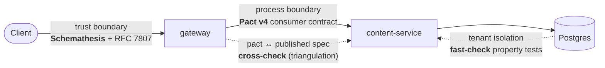

# QARoom

> **Testing as architecture.** A Reddit-shaped social platform built in public across ten milestones — each milestone places one testing technique at the architectural boundary it defends, demonstrates a bug only that technique catches, and ships a write-up of the reasoning.

QARoom is a multi-tenant social platform (communities, posts, votes, a gradually-rolled-out donations feature) built as the substrate for a single argument: **testability is an architectural property, not a milestone you bolt on at the end.** The product exists to teach; the architecture is the lesson. Written from the perspective of an SDET looking at system design through the testing lens.

## Status

**Milestone 0 shipped · Milestone 1 in progress.** Architecture and testing strategy are locked; the build is underway.

| | |
|---|---|
| **Current milestone** | 1 of 10 — gateway, consumer-driven contracts (Pact), trust-boundary fuzzing (Schemathesis), rate limiting |
| **Shipped** | Milestone 0 — determinism substrate, Zod→OpenAPI with `oasdiff` drift gate, branded IDs, RFC 7807, property + contract foundations |
| **Built so far** | 2 services · 4 shared packages · 1 custom lint plugin · **112 passing tests** (unit, property, integration, contract) · 6 ADRs · 6 Milestone-0 spikes · CI with schema-validated `test-results/summary.json` |
| **Locked** | [Vision](docs/01-vision.md) · [Architecture](docs/02-architecture.md) · [Testing strategy](docs/03-testing-strategy.md) · [Roadmap](docs/04-roadmap.md) · [Conventions](docs/05-conventions.md) · [ADR-0001](docs/adr/0001-foundational-decisions.md) |

## The one idea

Every architectural boundary has a categorical failure mode, and a specific testing technique that catches it where it lives:



The full nine-boundary map — temporal (XState MBT), observability (Tracetest), external dependency (chaos), identity, async, WebSocket — is in [docs/03 §5](docs/03-testing-strategy.md). The discipline that holds it together: **complexity must earn its place.** Every service, table, and abstraction exists because without it a specific testing demonstration would be impossible. When something can't name the technique it enables, it gets cut.

## What this is *not*

Not a tutorial on any one tool. Not a production-ready product (no real auth, payments, or i18n — deliberately). Not a complete reference architecture. It's a journey that builds a system one demonstrable testing technique at a time, and is honest about what each technique *misses*.

## Conventions are enforced, not suggested

The lint + CI gates fail the build on a violation — this is what "testability as architecture" means in practice:

- No `new Date()` / `Math.random()` / `crypto.randomUUID()` in non-test code — inject `Clock` / `Randomness` / `IdGenerator`.
- No `toMatchSnapshot()`. No conditional logic in tests. Test names describe the invariant, not the function.
- Every non-2xx response is RFC 7807 Problem Details with `retryable` / `next_actions` / `failure_domain`.
- OpenAPI is generated from Zod and `oasdiff`-gated; no contract changes silently.

## Repository tour

| Path | What |
|---|---|
| `services/` | One directory per microservice (`content`, `gateway`), each with its own `AGENTS.md`, `openapi.yaml`, tests. |
| `packages/contracts/` | Zod schemas — the single source of truth — plus OpenAPI generation and (later) XState machines. |
| `packages/service-kit/` | Shared service plumbing: RFC 7807 handler, `/system/*` routes, determinism bootstrap. |
| `packages/testing-utils/` | The test framework as a system: harness, generators, matchers, contract cross-check. |
| `docs/` | Architecture, strategy, roadmap, conventions, ADRs — read in numbered order. |

## How to navigate

- **First time?** Read [docs/01-vision.md](docs/01-vision.md) → `02` → `03` → `04` → `05` in order.
- **Reading the code?** [docs/00-tour.md](docs/00-tour.md) traces one create-post request through every boundary — naming the technique that defends each hop, with clickable `file:line` anchors.
- **An LLM agent?** Start with [AGENTS.md](AGENTS.md) (commands, layout, conventions, do-not-touch paths), then the docs above.

## Develop

```bash
pnpm install
pnpm test           # all layers
pnpm lint           # Biome + custom qaroom ESLint rules
pnpm openapi:verify # Zod→OpenAPI drift + oasdiff breaking-change gate
```

## License

Working assumption: **MIT** for code, **CC-BY** for written content. To be finalized before the first public release.
