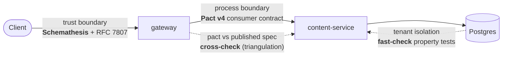

# QARoom

QARoom is an experiment about testing. The question behind it is simple: can you design a system so that testing is part of the architecture, and not a thing you bolt on at the end? Everything in this repo exists to answer that. The app itself, a social platform with communities, posts, votes, and a donations feature behind a flag, is only the specimen. I built it so each part of the system could demonstrate one modern testing technique at work.

The bigger picture I am after is defense in depth and breadth. Depth means a single boundary is guarded by more than one technique, stacked, so a bug that slips past one layer is caught by the next. Breadth means every boundary in the system gets its own defense, not only the easy ones. Together they form a grid: for each boundary, which techniques defend it, and at which layer. The repo is me filling in that grid one technique at a time, and being honest about what each technique does not catch.

I build it in public. For each part I find the boundary where things break, pick the technique that catches that kind of break, and then show a real bug that only that technique would find. I write the reasoning down as I go.

<!-- stats:start (generated by `pnpm stats:render --readme`; do not edit) -->
8 services · 7 packages + 1 helm chart · 22 ADRs · 9 boundaries · 3 falsifiable claims · 981 passed / 34 failed / 12 skipped across 32 runners

<sub>These numbers are read from the source (the test results, the manifest, the folders on disk), not typed by hand. `pnpm stats:render` writes this line and `pnpm claims:verify` fails the build if it goes stale.</sub>
<!-- stats:end -->

<!-- claims:start (generated by `pnpm claims:render --readme`; do not edit) -->
### Falsifiable claims

> Don't trust the green check. Flip the switch. Every claim comes with the bug that breaks it and the test that catches that bug. You run one command, a real test turns red. The status is read from the test run, not typed by hand. Full list and the matrix: `pnpm prove`.

| Claim | Boundary | Breaks when | Falsify |
|---|---|---|---|
| A webhook signature binds the timestamp, so a captured (body, signature) pair cannot be replayed. | `trust` | `CHAOS_WEBHOOK_SIGN_BODY_ONLY` | `pnpm prove webhook-signing --break` |
| Every webhook delivery reaches a terminal state; a failed send is retried, never silently dropped. | `process-async` | `CHAOS_WEBHOOK_DROP_ON_FAIL` | `pnpm prove webhook-at-least-once --break` |
| The moderator escalates to a human on a low-confidence verdict instead of guessing (FR5 calibration). | `external-dep` | `MODERATOR_DISABLE_ABSTAIN` | `pnpm prove moderator-abstain --break` |
<!-- claims:end -->

## Defense in depth and breadth

Every boundary fails in its own way. The job has two halves. Put the right technique at the boundary where the failure happens (breadth), and stack more than one technique at that boundary so no single layer is the only thing between a bug and production (depth).

This is what depth looks like on one path, the request that creates a post. Each hop is guarded, and some techniques cross-check each other so a gap in one shows up in another:



And this is breadth. Every boundary in the system has a defense, with the lead technique for each:

| Boundary | What can break | Lead technique |
|---|---|---|
| Trust (client to gateway) | malformed or hostile input | Schemathesis fuzzing, RFC 7807 errors |
| Process (service to service) | a contract drifts between two services | Pact v4 contracts, cross-checked against the published OpenAPI |
| Async (events over NATS) | a lost, duplicated, or reordered event | typed events, outbox, dedup, async Pact, Tracetest |
| State (rollouts, webhook delivery, migration) | an illegal state transition | XState machines, reverse-conformance, model-based testing |
| Temporal | logic that depends on the wall clock | an injected `Clock`, no real time in non-test code |
| Identity (communities as tenants) | one tenant reads another tenant's data | property-based isolation tests |
| Observability | a span without its tenant, a trace that breaks | every span carries `tenant.id`, checked in CI |
| External dependency (the LLM moderator) | a hallucinated or overconfident decision | retrieval grounding, eval, red-team, an abstain path |
| Delivery edge (outbound webhooks) | a replayed, dropped, or unsafe delivery | HMAC signing, SSRF guard, at-least-once with retries |

Depth is the second technique in many of those rows. The trust boundary, for example, is guarded by Zod validation, then Schemathesis fuzzing, then Pact contracts, then property tests. Each one catches a class of bug the others miss.

One rule keeps the whole thing honest: complexity must earn its place. Every service, table, and abstraction is here only because some testing demonstration needs it. If a thing cannot name the technique it enables, I remove it. The full boundary map and the reasoning behind each choice are in [docs/03](docs/03-testing-strategy.md).

## What this is not

It is not a tutorial for one tool. It is not production software (no real auth, no payments, no i18n, on purpose). It is not a finished reference architecture. It is one person building a system one testing technique at a time, and being honest about what each technique does not catch.

Left out on purpose: real auth, payments, i18n. Parked for later: continuous testing in production, visual and accessibility testing, and a record and replay layer for the LLM calls.

## Rules the build enforces

Lint and CI check these. Break one and the build fails. This is what "testing as architecture" means here in practice:

- No `new Date()`, `Math.random()`, or `crypto.randomUUID()` in non-test code. Inject `Clock`, `Randomness`, and `IdGenerator` instead.
- No `toMatchSnapshot()`. No `if` or `try` logic inside a test. A test name says the invariant, not the function name.
- Every non-2xx response is RFC 7807 Problem Details, with `retryable`, `next_actions`, and `failure_domain`.
- OpenAPI and AsyncAPI are generated from Zod and drift-gated. A contract cannot change quietly.
- Every NATS event has a Zod schema and a name. Raw subject strings fail lint; use the `subjects.ts` builders. A duplicate delivery cannot apply twice (outbox plus `Nats-Msg-Id` window plus `processed_events`).

## What is in the repo

| Path | What |
|---|---|
| `services/` | Eight services: `content`, `gateway`, `identity`, `flags`, `donations`, `web` (React/Vite), `moderator-agent` (Python, the one non-TS service), `webhooks`. Each has its own `AGENTS.md` and tests; backend services add `openapi.yaml` and `asyncapi.yaml`. |
| `packages/contracts/` | Zod schemas, the single source of truth. From them I generate OpenAPI and AsyncAPI, branded IDs, NATS subject builders, and XState machines. |
| `packages/messaging/` | The async SDK: transactional outbox plus relay, `Nats-Msg-Id` dedup, and NATS-header trace propagation. |
| `packages/otel/` | The OpenTelemetry setup, the `tenant.id` span processor, and the trace-context carrier the messaging layer uses. |
| `packages/service-kit/` | Shared service plumbing: the RFC 7807 handler, the `/system/*` routes, the determinism bootstrap. |
| `packages/testing-utils/` | The test framework as a system: the PGlite harness, generators, matchers, and contract plus AsyncAPI cross-checks. |
| `docs/` | Vision, architecture, strategy, roadmap, conventions, ADRs. Read in numbered order. |

## Where to start

- New here? Read the docs in order: [01-vision](docs/01-vision.md), then 02, 03, 04, 05.
- Reading the code? [docs/00-tour.md](docs/00-tour.md) follows one create-post request through every boundary and names the technique at each step, with clickable `file:line` links.
- An LLM agent? Start with [AGENTS.md](AGENTS.md), then the docs above.

## Run it

It runs with no Docker, because Postgres runs in-process with PGlite. So `pnpm test` is the quickest way to see it work:

```bash
pnpm install
pnpm test            # the full suite, no Docker (in-process PGlite): unit, property, integration, contract
pnpm lint            # Biome plus the custom qaroom ESLint rules
pnpm openapi:verify  # Zod to OpenAPI drift, plus the oasdiff breaking-change gate
pnpm asyncapi:verify # Zod to AsyncAPI drift, plus a direction-aware breaking-change classifier
pnpm claims:verify   # every claim resolves and is breakable, and the README cannot go stale
```

For the full system (all 8 services, NATS JetStream, OpenTelemetry into Jaeger, Grafana, Tracetest) on a local k3d cluster:

```bash
pnpm dev             # k3d + Tilt: build, deploy, live-reload. Jaeger :16686 · Grafana :3000 · Tracetest :11633
```

The test numbers come from `test-results/summary.json`, which CI produces. I do not type them by hand.

## License

MIT for the code (see [LICENSE](LICENSE)). CC-BY for the writing under `docs/`.
