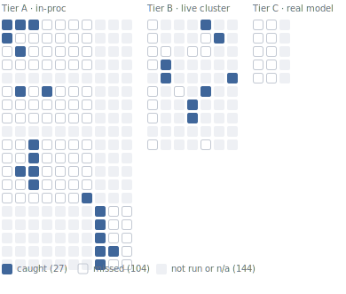

# QARoom

<!-- matrix-hero:start (generated by `pnpm matrix:render`; do not edit) -->
> **27 catches. 104 recorded misses. The misses are the point.**
> Every deliberate bug in this repo is armed, one at a time, against every testing technique. A filled cell is a catch. A hollow cell is a technique that ran and stayed green: measured blindness, recorded instead of hidden. The 117 faint cells are not applicable or not yet run.

<a href="docs/detection-matrix.md"><picture>
<source media="(prefers-color-scheme: dark)" srcset="docs/assets/detection-matrix-dark.svg">

</picture></a>
<!-- matrix-hero:end -->

QARoom is an experiment about testing: can you design a system so that testing is part of the architecture, and not a thing you bolt on at the end? The app (a small social platform: communities, posts, votes, a donations feature behind a flag) is only the specimen. The real product is defense in depth and breadth: every boundary defended by a named technique, more than one technique stacked at each, and an honest record of what each technique does not catch. One person builds it, in public: for each part, find the boundary where things break, pick the technique that catches that kind of break, show a real bug only that technique finds. The reasoning lands in a per-decision journey log that feeds the published posts (raw entries stay local on purpose).

<!-- stats:start (generated by `pnpm stats:render --readme`; do not edit) -->
8 services · 7 packages + 1 helm chart · 23 ADRs · 11 boundaries · 6 falsifiable claims

<sub>These counts are read from the source (the manifest + the folders on disk), not typed by hand. `pnpm stats:render` writes this line and `pnpm claims:verify` fails the build if it drifts. Live test totals come from a CI run's `test-results/summary.json` artifact (gitignored here); `pnpm prove` reads them locally.</sub>
<!-- stats:end -->

<!-- claims:start (generated by `pnpm claims:render --readme`; do not edit) -->
## Falsifiable claims

> Don't trust the green check. Flip the switch. Every claim comes with the bug that breaks it and the test that catches that bug. You run one command, a real test turns red. The status is read from the test run, not typed by hand. Full list and the matrix: `pnpm prove`; live verdicts: [docs/claims.md](docs/claims.md).

Falsify any row: `pnpm prove <id> --break`. The toggle each claim breaks under is in [docs/claims.md](docs/claims.md).

| Claim | Boundary | Id |
|---|---|---|
| A webhook signature binds the timestamp, so a captured (body, signature) pair cannot be replayed. | `delivery-edge` | `webhook-signing` |
| Every webhook delivery reaches a terminal state; a failed send is retried, never silently dropped. | `delivery-edge` | `webhook-at-least-once` |
| The moderator escalates to a human on a low-confidence verdict instead of guessing (FR5 calibration). | `external-dep` | `moderator-abstain` |
| The moderator fences attacker-controlled post bodies as DATA before they reach the model; disabling the guard leaves them in instruction context. | `external-dep` | `input-guard-fences-untrusted-body` |
| Every span the deployed system emits carries tenant.id (Commitment 9); a dropped stamp is caught by the live Jaeger audit. | `observability` | `tenant-span-everywhere` |
| The transactional outbox keeps mutating HTTP latency independent of the broker: publishing on the request path breaches the vote SLO even on a healthy broker. | `process-async` | `outbox-isolates-broker-latency` |
<!-- claims:end -->

<!-- matrix-teaser:start (generated by `pnpm matrix:render`; do not edit) -->
Three rows from [the matrix](docs/detection-matrix.md), to show what it measures:

| Deliberate bug | Caught by | What happened |
|---|---|---|
| `feed-reversed` | 1 of 11 | A reversed feed passed the entire in-proc battery. The hole was closed the same day; the row re-ran ✗ to ✓. |
| `vote-slow` | 1 of 9 | Invisible to every functional technique, by design: suites get slower, not redder. Only the k6 SLO threshold sees it. |
| `disable-circuit-breaker` | 1 of 9 | Missed in-proc, structurally. Caught live by paced fuzz traffic through an accidentally sick upstream. |
<!-- matrix-teaser:end -->

## Defense in depth and breadth

Every boundary fails in its own way. The job has two halves: put the right technique at the boundary where the failure happens (breadth), and stack more than one technique at that boundary (depth), so no single layer is the only thing between a bug and production.

Depth, on the one path that creates a post: Zod validation at the edge, then Schemathesis fuzzing, then a Pact v4 contract cross-checked against the published OpenAPI, then fast-check tenant-isolation properties at the database. Each layer catches a class of bug the others miss. The container view and the full request path live in [docs/02](docs/02-architecture.md).

And breadth. Every boundary in the system has a defense, with the lead technique for each:

<!-- boundaries:start (generated by `pnpm boundaries:render`; do not edit) -->
| Boundary | What can break | Lead technique |
|---|---|---|
| Trust (client to gateway) | malformed or hostile input | Schemathesis fuzzing, RFC 7807 errors |
| Process (service to service) | a contract drifts between two services | Pact v4 contracts, cross-checked against the published OpenAPI |
| Async (events over NATS) | a lost, duplicated, or reordered event | typed events, outbox, dedup, async Pact, Tracetest |
| State (rollouts, webhook delivery, migration) | an illegal state transition | XState machines, reverse-conformance, model-based testing |
| Temporal | logic that depends on the wall clock | an injected `Clock`, no real time in non-test code |
| Tenancy (communities as tenants) | one tenant reads another tenant's data | property-based isolation tests |
| Identity issuance (JWT and JWKS) | a token signed with a retired key, a rotation that strands sessions | JWKS contract tests, rotation as a state machine |
| WebSocket push | a stale socket, an unauthorized subscription, push/poll divergence | one-use ticket auth, polling-parity tests |
| Observability | a span without its tenant, a trace that breaks | every span carries `tenant.id`, checked live |
| External dependency (the LLM moderator) | a hallucinated or overconfident decision | retrieval grounding, eval, red-team, an abstain path |
| Delivery edge (outbound webhooks) | a replayed, dropped, or unsafe delivery | HMAC signing, SSRF guard, at-least-once with retries |
<!-- boundaries:end -->

One rule keeps the whole thing honest: complexity must earn its place. Every service, table, and abstraction is here only because some testing demonstration needs it. If a thing cannot name the technique it enables, I remove it. The full boundary map and the reasoning behind each choice are in [docs/03](docs/03-testing-strategy.md).

## What this is not

It is not a tutorial for one tool. It is not production software (no real auth, no payments, no i18n, on purpose). It is not a finished reference architecture. It is one person building a system one testing technique at a time, and being honest about what each technique does not catch.

Left out on purpose: real auth, payments, i18n. Parked for later: continuous testing in production, visual and accessibility testing, and a record and replay layer for the LLM calls.

## Rules the build enforces

Lint and CI check these. Break one and the build fails. CI runs on manual dispatch for now (a fresh private remote, no secrets or cluster wired); the same gates and more run locally via `pnpm gauntlet`. This is what "testing as architecture" means here in practice:

- No `new Date()`, `Math.random()`, or `crypto.randomUUID()` in non-test code. Inject `Clock`, `Randomness`, and `IdGenerator` instead.
- No `toMatchSnapshot()`. No `if` or `try` logic inside a test. A test name says the invariant, not the function name.
- Every non-2xx response is RFC 7807 Problem Details, with `retryable`, `next_actions`, and `failure_domain`.
- OpenAPI and AsyncAPI are generated from Zod and drift-gated. A contract cannot change quietly.
- Every NATS event has a Zod schema and a name. Raw subject strings fail lint; use the `subjects.ts` builders. A duplicate delivery cannot apply twice (outbox plus `Nats-Msg-Id` window plus `processed_events`).

## What is in the repo

| Path | What |
|---|---|
| `services/` | Eight services: `content`, `gateway`, `identity`, `flags`, `donations`, `web` (React/Vite), `moderator-agent` (Python, the one non-TS service), `webhooks`. Each has its own `AGENTS.md` and tests; backend services add `openapi.yaml` and `asyncapi.yaml`. |
| `packages/contracts/` | Zod schemas, the single source of truth. From them I generate OpenAPI and AsyncAPI, branded IDs, NATS subject builders, and XState machines. |
| `packages/messaging/` | The async SDK: transactional outbox plus relay, `Nats-Msg-Id` dedup, and NATS-header trace propagation. |
| `packages/otel/` | The OpenTelemetry setup, the `tenant.id` span processor, and the trace-context carrier the messaging layer uses. |
| `packages/service-kit/` | Shared service plumbing: the RFC 7807 handler, the `/system/*` routes, the determinism bootstrap. |
| `packages/testing-utils/` | The test framework as a system: the PGlite harness, generators, matchers, and contract plus AsyncAPI cross-checks. |
| `docs/` | Vision, architecture, strategy, roadmap, conventions, ADRs. Read in numbered order. |

## Where to start

- New here? Read the docs in order: [01-vision](docs/01-vision.md), then [02](docs/02-architecture.md), [03](docs/03-testing-strategy.md), [04](docs/04-roadmap.md), [05](docs/05-conventions.md).
- Reading the code? [docs/00-tour.md](docs/00-tour.md) follows one create-post request through every boundary and names the technique at each step, with clickable `file:line` links (drift-gated by `pnpm tour:verify`).
- Skeptical? The [detection matrix](docs/detection-matrix.md) is every deliberate bug versus every technique, empirically; the [gauntlet](docs/gauntlet.md) is the run that produces the evidence.
- An LLM agent? Start with [AGENTS.md](AGENTS.md), then the docs above.

The unnumbered docs hold the evidence: the [matrix](docs/detection-matrix.md), the [gauntlet](docs/gauntlet.md), [failure-modes](docs/failure-modes.md), [SLOs](docs/slos.md), and the [agentic-CI demo](docs/agentic-ci-demo.md). [docs/adr](docs/adr/) records the decisions.

## Run it

It runs with no Docker, because Postgres runs in-process with PGlite. So `pnpm test` is the quickest way to see it work:

```bash
pnpm install
pnpm test            # full suite, no Docker (in-process PGlite)
pnpm lint            # Biome plus the custom qaroom ESLint rules
pnpm openapi:verify  # Zod to OpenAPI drift + oasdiff breaking-change gate
pnpm asyncapi:verify # Zod to AsyncAPI drift + breaking-change classifier
pnpm claims:verify   # every claim is breakable; front door cannot go stale
pnpm tour:verify     # every code-tour file:line anchor still holds
```

For the full system (all 8 services, NATS JetStream, OpenTelemetry into Jaeger, Grafana, Tracetest) on a local k3d cluster:

```bash
# k3d + Tilt: build, deploy, live-reload.
# Jaeger :16686 · Grafana :3000 · Tracetest :11633
pnpm dev
```

One orchestrated run of every technique against the live cluster, evidence folded into one envelope: the [gauntlet](docs/gauntlet.md) (`pnpm gauntlet`, 2.5 to 3.5 hours, mostly walk-away).

Test numbers come from `test-results/summary.json`, which CI produces and uploads as a run artifact (it is gitignored, so you will not find it in the tree). I do not type them by hand.

The numbered docs are the argument. The matrix is the evidence. The claims are the dare.

## License

MIT for the code (see [LICENSE](LICENSE)). CC-BY for the writing under `docs/`.
