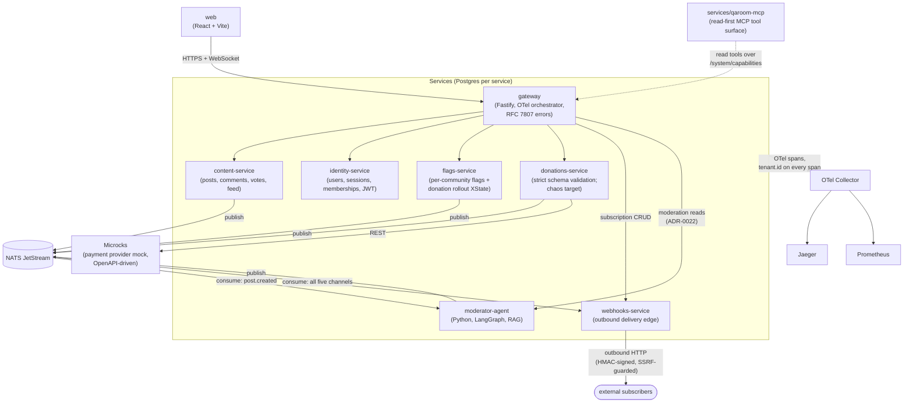

# QARoom: Architecture

This document records the locked architectural commitments and gives a one-page-equivalent view of the system at maturity. Implementation details and tool versions live in ADRs (`docs/adr/`); this document is about shape.

## The 17 locked commitments

These are immutable for the lifetime of v1. Changes require an ADR superseding the foundational one.

1. **Microservices on Kubernetes.** k3d for local development with Tilt for the inner loop; KinD in CI for ephemeral environments. Not Docker Compose; not a monolith.
2. **TypeScript end-to-end for core services.** Fastify for HTTP servers, Drizzle for database access, Zod for schema authority. Python is permitted for LLM-adjacent services: the Milestone 9 `moderator-agent` (`uv`/FastAPI/LangGraph) is the only one (ADR-0018).
3. **Schema-first contracts with triangulation, sync *and* async.** Zod schemas are the source of truth. OpenAPI YAML is generated from Zod and committed; `oasdiff` gates every PR for breaking changes. AsyncAPI YAML is also generated from Zod and committed; `@asyncapi/diff` (or custom thin diff) gates async breaking changes. Pact files (REST + message) are an independent second source of truth authored by consumers. Frozen `*.vN.yaml` (OAS) and `events/<name>.v{N}.ts` (event schemas) are the third source at release boundaries. No artifact is silently regenerated; every change to a contract is reviewable as a human-readable diff.
4. **Sync REST + async messaging hybrid.** REST for queries and external-facing endpoints; NATS JetStream for cross-service state-change events. `Idempotency-Key` header on all HTTP mutations; replays served from per-service `idempotency_responses` table. Single-writer-per-resource enforced by Postgres advisory locks (`pg_advisory_xact_lock` keyed on resource ID) + row-level `SELECT … FOR UPDATE`. Async dedup discipline in Commitment 17.
5. **All stateful flows are modeled as graphs.** XState v5 for TypeScript flows; LangGraph for Python flows (future). The model lives in `packages/contracts`, is authored by hand, is the contract that production code and tests both consult. State names are PascalCase and human-readable.
6. **Determinism abstractions in every service.** Every service accepts injectable `Clock`, `IdGenerator`, and `Randomness` interfaces. Production wires real implementations; tests wire seeded deterministic ones. Leakage of non-determinism (e.g., a direct `new Date()` call in business code) is a P0 defect. Two time layers: business logic reads only the injected `Clock`; OS time is reserved for chaos (`TimeChaos`). Snapshots record the **chaos manifest** (TimeChaos config: targets, skew, duration), not measured drift; replays reapply the manifest to a fresh cluster.
7. **Observable state per service.** Every service exposes `GET /system/state` (current model state, structured, including an `as_of: {snapshot_id, lamport, wall_clock}` envelope read at REPEATABLE READ isolation) and `GET /system/capabilities` (operations the service exposes, in MCP-tool-shaped JSON Schema form). All mutating paths (DB-backed and in-memory XState) flow through a single `LamportGate` so the counter increments on every write regardless of model substrate. Reverse conformance (system never enters off-model states) is enforced via OTel `xstate.transition` spans verified by Tracetest in CI; the instrumentation wrapper lives in `packages/contracts/instrumentation/`.
8. **Scoped scenario replay.** Per-service `GET/POST /system/snapshot` endpoints support capture and restore of database state plus observable state plus the current clock value. A `qaroom-replay` CLI orchestrates capture across services and reload into a Docker Compose environment. Documented limits: no in-flight HTTP request capture, no JetStream stream restore, no WebSocket session state.
9. **Communities are tenants.** Each community is an isolated tenant with its own data partition. Tenancy is implemented as a shared schema with a `community_id` discriminator column. Cross-community data leakage is impossible by enforcement at the service layer and verified by property-based isolation tests.
10. **Donations are the first feature gated by a per-community state machine.** The donation rollout state machine has explicit states (`DonationsOff`, `DonationsEnabling`, `DonationsOn`, `DonationsDisabling`) with documented observable behavior in each. Per-community feature flags drive the transitions.
11. **WebSockets for server push, with a polling fallback.** Light commitment: notifications and live feed updates, not collaborative real-time. Every WebSocket-delivered event is also retrievable via a polling endpoint so agents without WebSocket support can consume it.
12. **OpenTelemetry across all services, with GenAI semantic conventions opted in.** Manual trace propagation through NATS message headers via a shared `@qaroom/messaging` SDK. Every span carries `tenant.id`. Errors carry RFC 7807 Problem Details attributes.
13. **All errors follow RFC 7807 Problem Details, extended for agents.** Three extensions to the base envelope: `retryable: boolean`, `next_actions: Array<{verb, href, description}>`, `failure_domain: string`. Enforced by Zod schemas and verified in CI by Schemathesis.
14. **Test outputs are machine-readable.** Every test runner in CI emits structured JSON or JUnit XML. A `test-results/summary.json` artifact with a frozen schema aggregates all results per PR. This is the contract that future agentic CI consumes.
15. **The substrate is agent-hospitable from day one.** Required filesystem affordances: `/AGENTS.md` at the repo root with `/CLAUDE.md` as a symlink to it, per-service `AGENTS.md`, `.claude/agents/` and `.claude/skills/` directories present (canonical skill location), `scripts/spin-up-ephemeral.sh` script for namespaced ephemeral environments. No agentic features are built in v1; the affordances exist so they can be added without rework. (The original `/.well-known/llms.txt` clause was superseded by ADR-0023: twelve milestones produced zero consumers, and `AGENTS.md` plus `GET /system/capabilities` plus the qaroom-mcp surface won that role.)
16. **The repo is monorepo, pnpm workspaces, Turborepo.** One commit can change a service, its contracts, its tests, and the consumers of its contracts atomically.
17. **At-least-once async with explicit dedup.** Publishers set `Nats-Msg-Id` per event from the injected `IdGenerator`; JetStream streams configured with `duplicate_window: 5m`; transactional-outbox pattern on the publish side; consumers idempotent via a per-subscription `processed_events` table (schema housed in `@qaroom/messaging`) or pure-function semantics. Property-tested in CI. If NATS is unreachable at boot, a service crashes and lets Kubernetes restart it: crash-and-restart is the intended posture; webhooks-service's fail-soft boot (HTTP surface up, delivery engine degraded with a logged fault) is the deliberate exception, not the rule.

## Service inventory at maturity

QARoom matures to a set of core services plus supporting infrastructure. Each service's boundary exists because it teaches a specific testing technique.

| Service | Responsibility | Primary testing technique demonstrated |
|---|---|---|
| `gateway` | Auth check, request routing, response composition, OpenTelemetry orchestration | Consumer-side contract testing (Pact), Schemathesis fuzzing of the trust boundary |
| `identity-service` | Users, sessions, JWT issuance, community membership and roles | Provider-side contract testing (Pact); schema validation at the trust boundary |
| `content-service` | Posts, comments, votes; score aggregation; feed assembly | Property-based testing of voting invariants and tenant isolation; load testing |
| `flags-service` | Feature flag definitions; per-community flag resolution; donation rollout state machine | Model-based testing (XState); chaos engineering of cache invalidation |
| `donations-service` | Donation transactions; integration with the mocked payment provider | Schema validation (strict, untrusted external boundary); chaos engineering (external dependency failure) |
| `web` *(Milestone 5, React + Vite)* | Frontend: atomic-design component library, donations-rollout dashboard, WebSocket live updates with polling parity | Storybook play() + a11y and Playwright Component Tests sharing Screenplay Tasks; model-based E2E through the same XState rollout machine the server drives |
| `moderator-agent` *(Milestone 9, Python/LangGraph; retrieval-grounded RAG v2 in Milestone 12)* | Subscribes to `post.created`; judges posts against the per-community policy corpus; records a citation-bearing disposition (proposes, does not enforce) and emits it | LLM evaluation: DeepEval (RAG, agentic, G-Eval quality) + DeepTeam (OWASP LLM Top 10) + PyRIT (multi-turn red-team) + metamorphic paraphrase-invariance; LangGraph reverse-conformance; structured-output contract (ADR-0020) |
| `webhooks-service` *(Milestone 11)* | Consumes all five event channels; delivers them to external subscribers (at-least-once, deterministic retry/backoff, HMAC signing, SSRF guard); subscription CRUD gateway-proxied | Delivery-guarantee + retry-contract property testing; XState reverse-conformance of the delivery lifecycle; HMAC/SSRF property tests; chaos of a flaky receiver |

Supporting infrastructure deployed alongside:

- **PostgreSQL per service** (one logical database per service; physical isolation in production, logical in dev).
- **NATS JetStream** as the message broker, with durable streams per topic.
- **Microcks** for service virtualization (payment provider mock; potentially consumer Pact stubs).
- **OpenTelemetry Collector** + **Jaeger** for tracing; **Prometheus** + **Grafana** for metrics.
- **Tracetest** for trace-based assertions in CI.
- **Chaos Mesh** + **LitmusChaos** (Litmus for HTTP-level chaos that Chaos Mesh struggles with on k3d's flannel CNI).

## Container view

In prose: web -> gateway -> {content, identity, flags, donations}, with the gateway also proxying webhook subscription CRUD and moderation reads (ADR-0022); content, flags, donations, and the moderator publish to NATS JetStream, where the moderator-agent and webhooks-service consume; webhooks delivers outbound HTTP to external subscribers; donations calls the Microcks payment mock; services/qaroom-mcp is the read-first MCP surface over the services' capabilities; and every service's OTel spans flow to the collector, then to Jaeger and Prometheus.

This is the maturity view. Earlier milestones have only a subset of services; see `docs/04-roadmap.md` for which services exist in which milestone.

## Boundaries enumerated

Service boundaries are not architectural noise; they are where bugs live and where testing techniques apply. QARoom has the following categories of boundary, each with its assigned defender:

<!-- boundaries:start (generated by `pnpm boundaries:render`; do not edit) -->
| Boundary | What can break | Lead technique |
|---|---|---|
| Trust (client to gateway) | malformed or hostile input | Schemathesis fuzzing, RFC 7807 errors; on the web→gateway consumer side, the shared-Zod contract and the golden-journey harness (run via the gauntlet) |
| Process (service to service) | a contract drifts between two services | Pact v4 contracts, cross-checked against the published OpenAPI |
| Async (events over NATS) | a lost, duplicated, or reordered event | typed events, outbox, dedup, async Pact, Tracetest |
| State (rollouts, webhook delivery, migration) | an illegal state transition | XState machines, reverse-conformance, model-based testing |
| Temporal | logic that depends on the wall clock | an injected `Clock`, no real time in non-test code |
| Tenancy (communities as tenants) | one tenant reads another tenant's data | property-based isolation tests |
| Identity issuance (JWT and JWKS) | a token signed with a retired key, a rotation that strands sessions | JWKS contract tests, rotation as a state machine |
| WebSocket push | a stale socket, an unauthorized subscription, push/poll divergence | one-use ticket auth, polling-parity tests |
| Observability | a span without its tenant, a trace that breaks | every span carries `tenant.id`, checked live |
| External dependency (the LLM moderator) | a hallucinated or overconfident decision | retrieval grounding, eval, red-team, an abstain path |
| External payment (donations to the payment provider) | the payment provider faults, declines, or its REST contract drifts | a Microcks contract mock, an injectable payment-client seam, RFC 7807 `dependency_failure` on a fault |
| Delivery edge (outbound webhooks) | a replayed, dropped, or unsafe delivery | HMAC signing, SSRF guard, at-least-once with retries |
<!-- boundaries:end -->

The source of truth for these rows is `packages/contracts/src/boundary-registry.ts`; this table is rendered from it (`pnpm boundaries:render`) and byte-gated by `pnpm claims:verify`, so it cannot drift from the registry. The richer per-technique prose (what each catches, the chaos and metamorphic detail) lives in `docs/03-testing-strategy.md` §5.

These boundary types are the contract between architecture and testing: every service must respect the ones it touches.

## Technology choices

Locked at the architectural level (these are not implementation details):

| Concern | Choice | Reasoning |
|---|---|---|
| Container runtime | Kubernetes | Industry-standard substrate; required for Chaos Mesh and OTel Operator |
| Local cluster | k3d | Lightweight, fast startup, single-node convenience |
| CI cluster | KinD | Standard for GitHub Actions Kubernetes integration |
| Inner-loop dev | Tilt | Live updates, multi-service web UI, dependency graph |
| Service framework | Fastify (TS) | Lighter than Nest; first-class TypeScript; OpenAPI integration |
| ORM | Drizzle (TS) | TS-first, simple, no decorator magic |
| Schema authority | Zod | TS-first, ecosystem mature, generates OpenAPI |
| Message broker | NATS JetStream | Lightweight, single binary, supports both pub/sub and durable streams |
| Database | PostgreSQL (one logical DB per service) | Predictable, well-tested, supports transactional outbox |
| Frontend | React + Vite + Tailwind 4 | TS-native; Storybook/Playwright-CT-friendly; no server runtime the demo needs (ADR-0005) |
| State machines (TS) | XState v5 | The model authority; @xstate/graph for MBT |
| State machines (Python) | LangGraph | Same graph-as-truth principle for the future moderator |
| Monorepo | pnpm workspaces + Turborepo | Atomic changes across services |
| Lint/format | Biome | Faster than ESLint+Prettier, single tool |

Implementation-level choices (specific library versions, configuration details, helm chart structure) live in per-milestone ADRs.

## What this architecture deliberately omits

These omissions are part of the architectural contract:

- **No service mesh** (Istio, Linkerd). Chaos Mesh + Litmus + manual OTel propagation cover the same ground, and a mesh would bury the testing story under wiring.
- **No multi-region deployment.** Everything runs in a single region.
- **No real OAuth or federated identity.** JWT issued by identity-service is sufficient.
- **No edge authentication at the gateway.** The gateway routes and proxies (including the identity and moderation-read passthroughs of ADR-0022) without enforcing JWTs on inbound requests; rate limiting keys on a caller-supplied principal header or IP. Planned supersession: the parked M13 (real edge credentials: signup/login, JWT enforcement at the gateway, rate limiting keyed on authenticated identity; see `docs/04-roadmap.md`).
- **No real payments.** The payment provider is mocked via Microcks.
- **No internationalization.** QARoom is English-only.
- **No production-grade security testing** (SAST/DAST/dependency scanning). Mentioned in conventions; not enforced as a milestone.
- **No accessibility testing** as a milestone. UI is functional, not accessibility-certified.
- **No visual regression testing** in v1. Could be added in Milestone 5 as a sidebar.
- **No MCP servers per service in v1.** Designed-for-later; the architecture leaves the seam (Commitment 7's `/system/capabilities`).

Each omission is deliberate, and the reason for each is recorded in the list above.

## What this architecture is designed to make easy later

These are the seams left deliberately in place for future work:

- **MCP servers per service**: `/system/capabilities` returns MCP-tool-shaped JSON; FastMCP or Stainless can wrap each service when needed. The cross-service variant is *realized in Milestone 10* (ADR-0006): `services/qaroom-mcp`, a first-class tested service; per-service wrappers remain the open seam.
- **Agentic community moderator**, *realized in Milestone 9 and re-scoped to retrieval-grounded RAG in Milestone 12* (ADR-0018, ADR-0020): the `moderator-agent` consumes the NATS event stream and fills the reserved LangGraph slot.
- **Per-agent ephemeral environments**: `scripts/spin-up-ephemeral.sh` provisions namespaces; agents get one each when needed.
- **Agentic CI/CD demonstration**, *realized in Milestone 10, movement 2* (`docs/agentic-ci-demo.md`): Claude Code subagents work goals through the tested MCP tool surface and consume the frozen `test-results/summary.json` artifact.
- **Webhooks**, *realized in Milestone 11* (ADR-0019): `webhooks-service` consumes the five NATS event topics and delivers them to external subscribers (at-least-once, deterministic retry/backoff, HMAC signing, SSRF guard). The seam paid off: it consumes the existing event bus and adds no new commitment.
- **Continuous testing in production**: feature flag system, observability stack, and rollout state machine are the substrate.

The architecture is sized exactly for v1, but every seam needed for likely v2/v3 work is in place. This is the discipline that the testing lens demands and that the agent-hospitability research validated.
