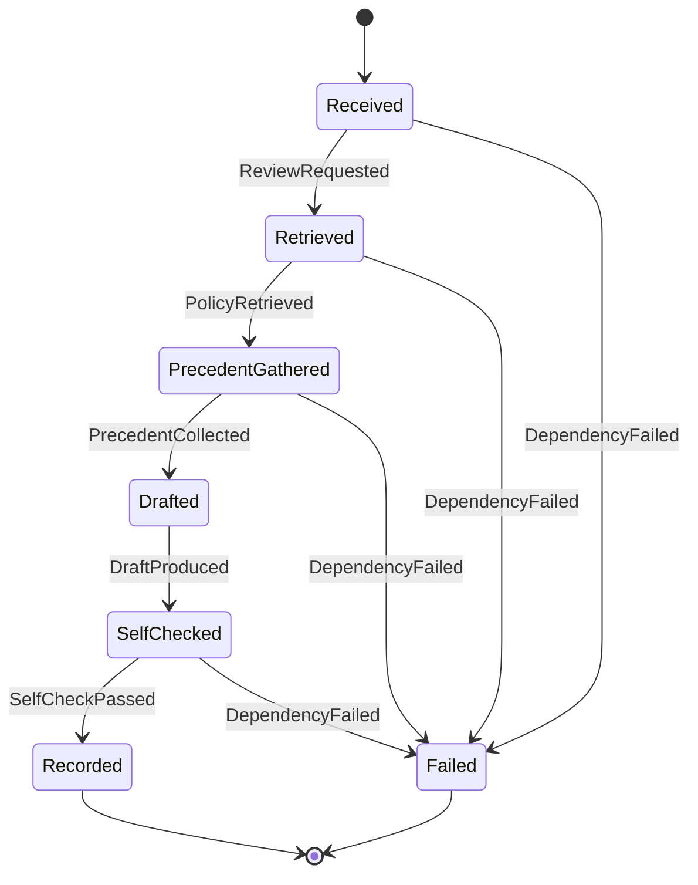

# moderator-agent

QARoom's LLM community moderator (Milestone 9, re-scoped in Milestone 12) — the project's first Python
service. It subscribes to `post.created` across every community over NATS, judges each post against
that community's documented rules, and **records a decision it proposes (it does not enforce)**: it
persists the decision in its own Postgres and emits `qaroom.moderator.decision.<community_id>.recorded`.

As of Milestone 12 ([ADR-0020](../../docs/adr/0020-moderator-rag-and-eval-stack.md)) it is a genuine
**retrieval-grounded RAG agent**, not a prompt-baked classifier (FR1–FR6). Per community there is a
versioned **policy corpus** — rules, escalation guidelines, and prior decisions (precedent) — embedded
in `pgvector`. For each post the agent **retrieves** top-k policy chunks + similar past decisions, then
**reasons over the retrieved context** to produce a citation-bearing, structured verdict: a
`disposition ∈ {approve, remove, escalate_to_human}` carrying `cited_rules[]`, `precedents[]`, a
`departs_from_precedent` flag, and a `rationale` traceable to the retrieved chunks. On low retrieval
confidence or conflicting rules it **abstains** — `escalate_to_human` — rather than guess.

It is still "an LLM agent on rails": the trajectory is a hand-authored state machine (LangGraph), every
LLM call is pinned (`temperature=0`, fixed `seed`, structured outputs validated against a Pydantic
schema), and every transition is conformance-checked exactly like the XState services (ADR-0012). The
verdict→disposition contract change is a breaking event v2.

See [ADR-0017](../../docs/adr/0017-testing-ai-integrated-systems.md) and
[ADR-0020](../../docs/adr/0020-moderator-rag-and-eval-stack.md) for the testing techniques and
[ADR-0018](../../docs/adr/0018-moderator-agent-architecture.md) for the architecture.

## The workflow as a state graph

Each review of one post walks this machine. The model in `src/moderator_agent/workflow/model.py` is
the single authority on which transitions are legal; the LangGraph runner emits an `xstate.transition`
span per step (identical attributes to the XState services) so the Tracetest reverse-conformance
assertion holds for the agent too.



- **Received → Retrieved** (`ReviewRequested`): retrieve top-k policy chunks for the community from
  the `pgvector` corpus (rules + escalation guidelines).
- **Retrieved → PrecedentGathered** (`PolicyRetrieved`): gather nearest-neighbour past decisions
  (precedent) for similar content.
- **PrecedentGathered → Drafted** (`PrecedentCollected`): the LLM reasons over the retrieved context
  and drafts a citation-bearing `disposition` (`approve` / `remove` / `escalate_to_human`) with
  `cited_rules[]`, `precedents[]`, and a `rationale`.
- **Drafted → SelfChecked** (`DraftProduced`): a **pure** self-check validates the citations against
  the retrieved chunks and sets `departs_from_precedent` / the abstain decision — no I/O, so it
  declares no failure edge.
- **SelfChecked → Recorded** (`SelfCheckPassed`): persist the decision (single-writer per post),
  remember the post embedding, bump the LamportGate, and publish the event.
- **{Received, Retrieved, PrecedentGathered, SelfChecked} → Failed** (`DependencyFailed`): a
  dependency error at any I/O node (corpus, embeddings, LLM, DB) ends the run in `Failed`, surfaced in
  `/system/state` (recovery is via replay; auto-retry is out of scope — ADR-0018).

## Testing techniques (ADR-0017, ADR-0020)

- **RAG + agentic evaluation (DeepEval):** the single CI eval harness (Apache-2.0, pytest-native,
  vendor-neutral judge). RAG metrics (faithfulness, contextual precision / recall / relevancy),
  agentic metrics (task completion, tool correctness, trajectory), and custom G-Eval metrics
  (precedent-consistency, calibration / should-have-abstained). A planted hallucinated-policy
  regression is caught by faithfulness and *missed* by a non-grounded eval — why grounding matters.
  RAGAS is **not** a separate framework; its metrics ride DeepEval's `RAGASMetric` wrapper.
- **Red-team (DeepTeam, PyRIT):** `model_callback` wraps the moderator; OWASP LLM Top 10. The headline
  target is **prompt-injection-in-post-body** (untrusted content flowing to the LLM) — neutralised by
  the input guard (`guard.py`), and `MODERATOR_DISABLE_INPUT_GUARD=1` breaks it (failure-modes §09).
  PyRIT is an optional nightly for multi-turn depth.
- **Metamorphic test:** a benign paraphrase must get the same disposition. The `MODERATOR_PROMPT_BUG`
  toggle makes the prompt phrasing-sensitive — the metamorphic test **catches** it while a golden eval
  **misses** it. That gap is the whole point.
- **Structured-output contract:** the emitted event's Pydantic output is validated against the
  Zod-generated JSON Schema, gated on both sides.
- **LangGraph reverse conformance:** every emitted transition must be a legal edge of the model.

**Promptfoo is dropped** (ADR-0020): OpenAI acquired it in March 2026, realizing the
"OpenAI evaluating OpenAI" conflict ADR-0017 flagged. The DeepEval / DeepTeam runners are key-gated +
cost-guarded and fold into `summary.json` with no schema change.

## Run it

The commands live in `AGENTS.md`. Quick start for the deterministic suite (no network, no DB):

```bash
pnpm --filter @qaroom/moderator-agent test
```
